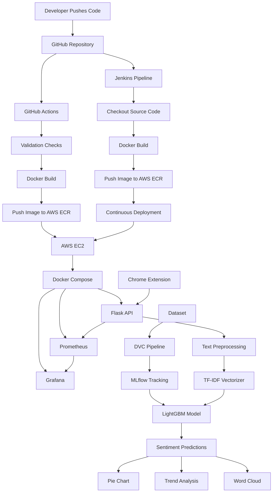
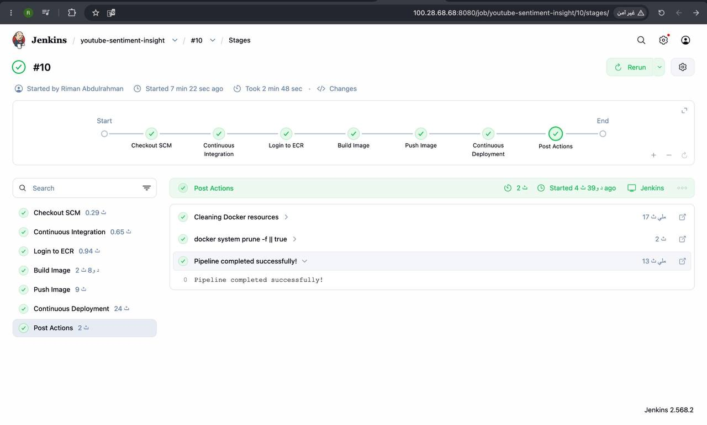
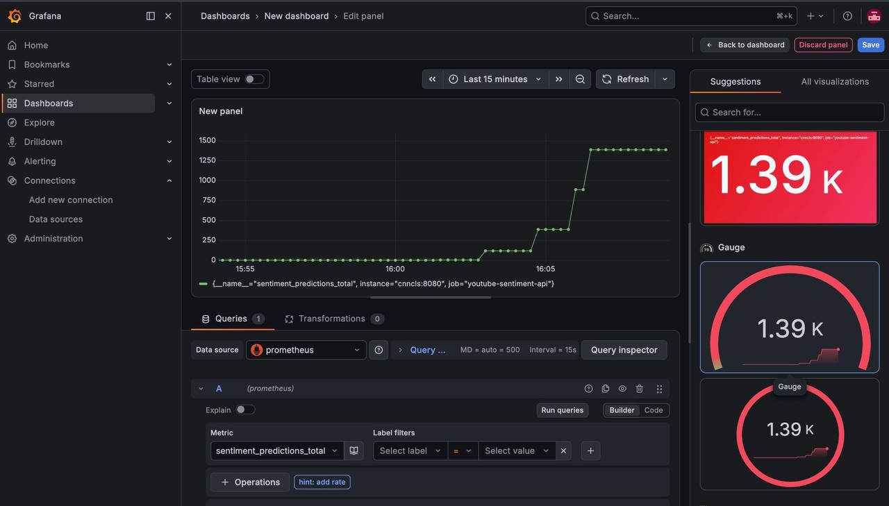
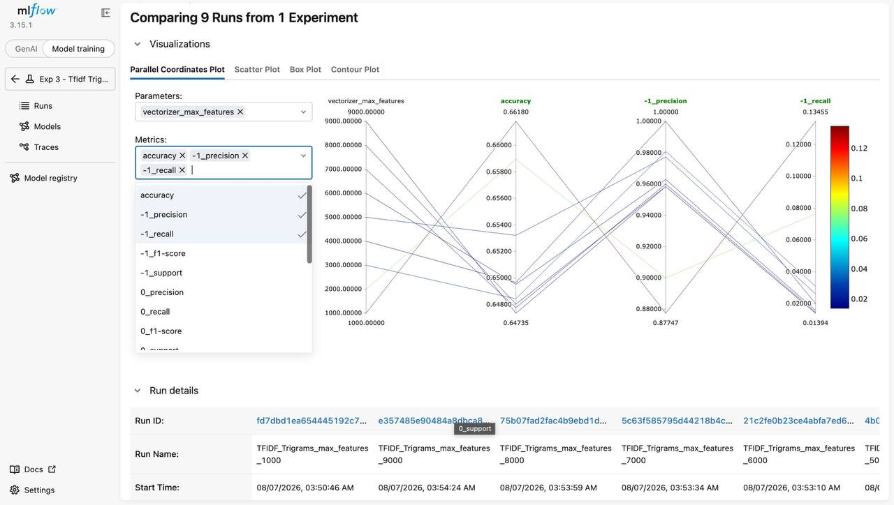
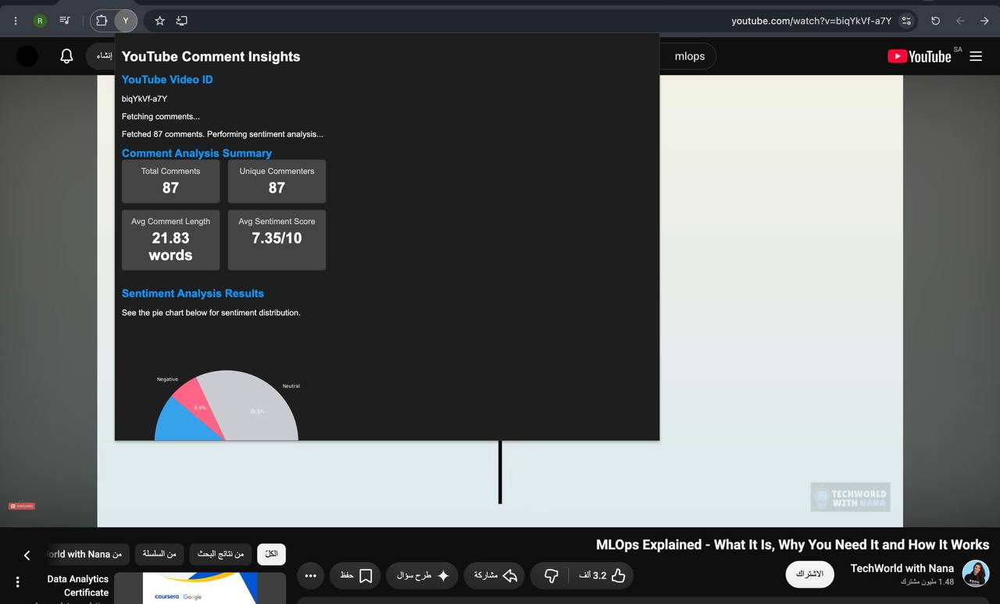
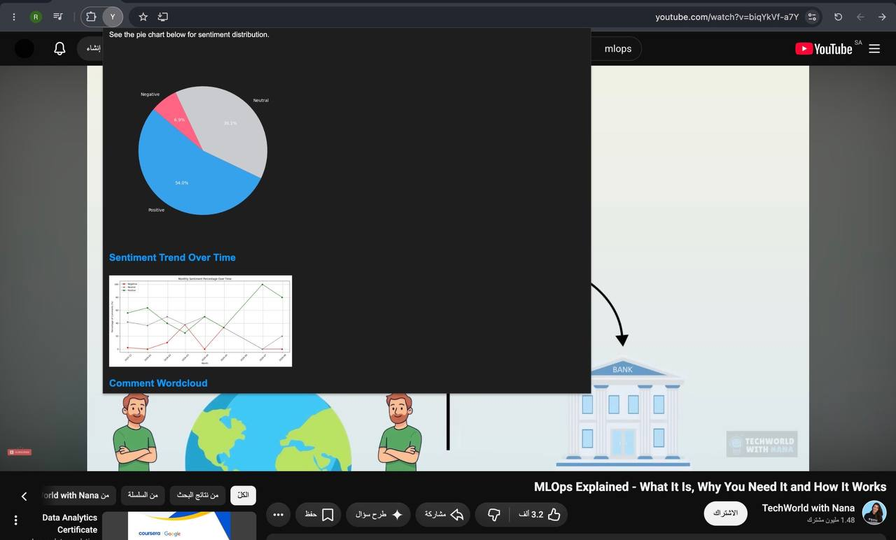
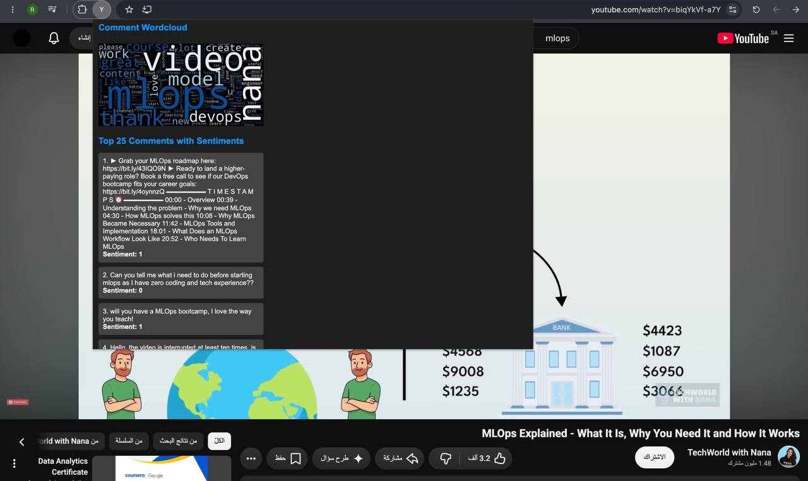

# YouTube Sentiment Insight


An end-to-end MLOps project that analyzes YouTube comments using Machine Learning and delivers sentiment insights through a Chrome Extension, automated CI/CD pipelines, cloud deployment, experiment tracking, and monitoring.

---

## Project Overview

YouTube Sentiment Insight is a complete MLOps solution that collects comments from YouTube videos, performs sentiment analysis using a trained LightGBM model, and presents meaningful visual insights to users.

The project demonstrates the integration of Machine Learning, MLOps, Cloud Computing, Monitoring, and DevOps practices within a production-style environment.

Users can analyze YouTube comments directly through a Chrome Extension and instantly receive:

- Sentiment Classification
- Sentiment Distribution
- Trend Analysis
- Word Cloud Visualization
- Comment Statistics

---

## Key Features

- Analyze YouTube comments automatically
- Classify comments into Positive, Neutral, and Negative sentiments
- Chrome Extension integration
- Interactive sentiment visualization
- Sentiment trend analysis over time
- Word cloud generation
- ML experiment tracking using MLflow
- Data and pipeline versioning using DVC
- Containerized deployment using Docker
- CI/CD automation using GitHub Actions and Jenkins
- AWS deployment using EC2 and ECR
- Monitoring and observability using Prometheus and Grafana

---

## System Architecture



---

## Machine Learning Pipeline

The model development process follows an MLOps workflow:

### Data Processing

- Raw YouTube comments
- Text cleaning
- Stopword removal
- Lemmatization
- Feature extraction using TF-IDF

### Model Training

- LightGBM Classifier
- Hyperparameter experimentation
- Performance evaluation

### Experiment Tracking

MLflow was used to:

- Track experiments
- Compare model runs
- Monitor metrics
- Store training results

### Data Versioning

DVC was used to:

- Track datasets
- Version ML artifacts
- Reproduce experiments

---

## Technology Stack

### Machine Learning

- LightGBM
- Scikit-learn
- TF-IDF
- NLTK
- Pandas
- NumPy

### Backend

- Flask
- Flask-CORS

### Frontend

- Chrome Extension
- HTML
- CSS
- JavaScript

### MLOps

- MLflow
- DVC
- Docker

### CI/CD

- GitHub Actions
- Jenkins

### Cloud

- AWS EC2
- AWS ECR

### Monitoring

- Prometheus
- Grafana

---

## CI/CD Pipeline

The project implements automated Continuous Integration and Continuous Deployment workflows.

### GitHub Actions

GitHub Actions performs:

- Code validation
- Dependency installation
- Docker image build
- Image publishing

### Jenkins

Jenkins performs:

- Source code checkout
- Docker image creation
- Push image to AWS ECR
- Continuous deployment to AWS EC2

---

## Jenkins Pipeline



---

## Deployment

The application is deployed on AWS using:

### AWS ECR

Used as a container registry for storing Docker images.

### AWS EC2

Hosts the deployed application and monitoring stack.

### Docker Compose

Orchestrates:

- Flask API
- Prometheus
- Grafana

---

## Monitoring and Observability

The project includes real-time monitoring using Prometheus and Grafana.

### Prometheus Metrics

The API exposes:

- sentiment_predictions_total
- prediction_duration_seconds
- prediction_errors_total

### Grafana Dashboards

Grafana visualizes:

- Total Predictions
- Prediction Activity
- Error Metrics
- Application Health

---

## Grafana Dashboard



---

## MLflow Experiment Tracking

MLflow was used to compare model runs and evaluate different configurations.

Tracked information includes:

- Accuracy
- Precision
- Recall
- F1 Score
- Model Parameters

---

## MLflow Tracking



---

## Chrome Extension

The Chrome Extension allows users to analyze comments directly from YouTube videos.

### Features

- Extract comments automatically
- Run sentiment analysis
- View sentiment distribution
- Generate trend analysis
- Generate word clouds

---

## Chrome Extension Interface








---

## API Endpoints

### Home

```http
GET /
```

Returns API status.

---

### Predict Sentiment

```http
POST /predict
```

Request:

```json
{
  "comments": [
    "Amazing video!",
    "I didn't like this content."
  ]
}
```

---

### Predict with Timestamps

```http
POST /predict_with_timestamps
```

---

### Generate Pie Chart

```http
POST /generate_chart
```

---

### Generate Word Cloud

```http
POST /generate_wordcloud
```

---

### Generate Trend Analysis

```http
POST /generate_trend_graph
```

---

### Prometheus Metrics

```http
GET /metrics
```

---

## Project Structure

```text
youtube-sentiment-insight/
│
├── flask_api/
├── src/
├── notebooks/
├── .github/workflows/
├── .jenkins/
├── vt-chrome-plugin-frontend/
├── assets/
│   ├── architecture.png
│   ├── extension.png
│   ├── grafana.png
│   ├── mlflow.png
│   └── jenkins.png
│
├── Dockerfile
├── Docker-compose.yaml
├── dvc.yaml
├── params.yaml
├── prometheus.yml
├── requirements.txt
├── lgbm_model.pkl
├── tfidf_vectorizer.pkl
└── README.md
```

---

## Future Improvements

- MLflow Model Registry integration
- Automated model retraining
- Data drift monitoring
- Kubernetes deployment
- Automated testing pipeline
- Real-time streaming inference
- Advanced analytics dashboard

---

## Results

The project successfully demonstrates:

- End-to-end Machine Learning deployment
- MLOps best practices
- Cloud-native deployment
- Automated CI/CD pipelines
- Monitoring and observability
- Scalable containerized infrastructure

---

## Author

### Riman Abdulrahman Bin Ragoosh

Bachelor of Computer Science (AI Track)  
King Abdulaziz University

---

## License

This project is developed for educational and portfolio purposes.
